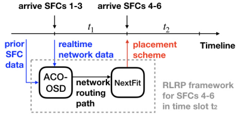

---
header-includes:
  - \usepackage{algorithm}
  - \usepackage{algorithmic}
  - \newcommand{\PROCEDURE}{\STATE \textbf{procedure}}
CJKmainfont: "Family Song"
output:
    pdf_document
---

# 论文信息

- 标题：Ant Colony based Online Learning Algorithm for Service Function Chain Deployment
- 时间：2023
- 会议：INFOCOM
- 算法名称：ACO-OSD, PLRP
- 作者：Yingling Mao, Xiaojun Shang, and Yuanyuan Yang
- 实验环境：
- 数据集：

# 一、问题场景

注意空间拓朴、业务模式、系统时间动态性等，明确描述所要解决的问题

商业服务器：

- 多个服务器之间有直接连接
- 每个服务器有多种计算资源，如 CPU 、 RAM 等
- 服务器之间连接的路由器有最大传输速率上限
- 服务器要么开着，要么关着，消耗资源的多少不影响其开启时的基础开销
- 当服务器上没有运行的服务时，服务器会关闭，被调度到关闭服务器上的服务会带来启动开销

SFC:

- SFC 会超时；
- SFC 由 VNF 构成，两个接续的 VNF 之间有数据流

问题：
如何将 SFC 部署到多个服务器上并满足：

- 服务部署开销较小；
- 服务延迟较小。

# 二、研究对象

其他与本文相关的工作大多没有考虑到多资源种类、排队时延、在线服务请求、超时机制。在向已经存在的调度策略引入这些变量时，大多数模型都会崩坏。

文章通过从元启发式算法入手，通过流行的 Ant Conlony Optimization 算法结合模型来解决问题。

# 三、数学模型

是一个什么数学问题，工程问题与数学问题之间的映射关系，有什么难点，采用了什么数学工具求解，有什么性能保证/理论结果/理论深度

服务器网络是 $G=(V,E)$ 的有向图；

$V=\{V_1, V_2, \cdots, V_M\}$ 表示服务器；

如果 $(V_p, V_q) \in E$ 就表示这两台服务器之间有直接的物理连接，这条连接的带宽和延时用 $B_{p,q}, l_{p,q}$ 分别表示。反之就是表示两台服务器之间没有直接连接。

$R_k^{CPU}$ 和 $R_k^{RAM}$ 标记了每个服务器 $V_k$ 的相关资源总量。

对于 $V_k$ 来说，服务器有开和关两种状态， $s_k(t)=1$ 时标志 $V_k$ 开机。

对 SFC 的建模：

在一段时间 $T$ 内共有 $m$ 个服务请求，每个服务请求需要一个 SFC 实现。在一个时隙中，服务器进行如下操作：

1. 删除超时的 SFC ；
2. 更新网络状态；
3. 收取到达的服务请求；
4. 决策 SFC 如何部署；
5. 更新网络状态。

$e_i(t)$ 表示在时隙 $t$ 时第 i 个 NFC 是否仍然未超时，也就是说：

$$\
e_i(t) \Leftrightarrow t_i^s \leq t \leq t_i^s + t_i^l
$$

决策变量：

$x^k_{i,j}$ 是一个二值变量，只有第 $i$ 个服务请求的第 $j$ 个子函数 $F_{i,j}$ 部署到 $V_k$ 上时该值才会等于 1 。

资源约束：

$$\
\sum_{i=1}^m\sum_{j=1}^{n_i} x^k_{i,j} \cdot f^X_{i,j} \cdot e_i(t) \leq R_k^X,
\forall 1\leq k \leq M, t \in T
$$

VNF 不能分割：

$$\
\sum_{k=1}^M x^k_{i,j} = 1,
 \forall 1 \leq i \leq m, 1 \leq j \leq n_i
$$

VNF 的部署情况与服务器开启状态对应：

$$\
s_k(t) = \begin{cases}
    1, \sum_{i=1}^m\sum_{j=1}^{n_i} x^k_{i,j} \cdot e_i(t) > 0, \\
    0, \sum_{i=1}^m\sum_{j=1}^{n_i} x^k_{i,j} \cdot e_i(t) = 0.
\end{cases}
$$

数据流路由：

$w_{i,j}^{p,q} = 1$ 等价于 $F_{i,j}$ 和 $F_{i,j+1}$ 之间的数据流经过了链路 $(v_p, V_q)$

由流量守恒，

$$\
\sum_{p=1}^M w_{i,j}^{p,k} - \sum_{q=1}^M w_{i,j}^{k,q} = x^k_{i,j+1} - x^k_{i,j}
$$

带宽约束：

$$\
\sum_{i=1}^m\sum_{j=1}^{n_i-1} (w_{i,j}^{p,q}+w_{i,j}^{q,p}) \cdot \lambda_i \cdot e_i(t) \leq B_{p,q}
$$

时延建模：

总体时延包括排队时延和传输时延，排队使用的是经典的 M/M/1 模型，平均排队时延为：

$$\
l'_k(t) = \left(
    \mu_k-\sum_{i=1}^m
        \left(
            x_{i,1}^k+
            \sum_{j=1}^{n_i-1}
            \sum_{p=1}^{M}
            w_{i,j}^{p,k}
        \right)
        \cdot \lambda_i \cdot e_i(t)
    \right)^{-1}
$$

路由器容量约束：

$$\
\sum_{i=1}^m
\left(
    x_{i,1}^k+
    \sum_{j=1}^{n_i-1}
    \sum_{p=1}^{M}
    w_{i,j}^{p,k}
\right)
\cdot \lambda_i \cdot e_i(t)
< \mu_k
$$

总体启动开销：

$$\
\mathbb{C} = \sum_{t\in T} \sum_{k=1}^M C_k \cdot s_k(t)
$$

总体延迟：

$$\
\mathbb{L} = \mathbb{D}_t + \mathbb{D}_q
$$
$$
\mathbb{D}_t = \sum_{t\in T} \sum_{i=1}^m \sum_{j=1}^{n_i-1} \sum_{p=1}^M \sum_{q=1}^M l_{p,q} \cdot w_{i,j}^{p,q} \cdot e_i(t)
$$
$$
\mathbb{D}_q = \sum_{t\in T} \sum_{i=1}^m
\left(
    x_{i,1}^k+
    \sum_{j=1}^{n_i-1}
    \sum_{p=1}^{M}
    w_{i,j}^{p,k}
\right)
\cdot e_i(t) \cdot l'_k(t)
$$

目标函数：

$$\
\min \mathbb{W} = \alpha \cdot \mathbb{C} + \beta \cdot (\mathbb{D}_t + \mathbb{D}_p)
$$

# 四、算法设计

与数学模型的关系，如何实现了创新思路

使用蚁群算法。

两个核心思想：

- 多对一的匹配机制；
- Next-Fit 的匹配策略。

每个时隙的输入：

- 新到达的任务 $i_0, \cdots, i_s$：包括 VNF 和相应资源要求
- 当前可用资源： $r_k^X=R_k^X-\sum_{i=1}^{i_0-1}\sum_{j=1}^{n_i} x^k_{i,j} \cdot f^X_{i,j} \cdot e_i(t)$
- 路由器可用处理能力：$\mu_k' = \mu_k-\sum_{i=1}^{i_0-1}
    \left(
        x_{i,1}^k+
        \sum_{j=1}^{n_i-1}
        \sum_{p=1}^{M}
        w_{i,j}^{p,k}
    \right)
    \cdot \lambda_i \cdot e_i(t)$
- 链路 $(V_p, V_q)$ 可用带宽：$b_{p,q} = B_{p,q} - \sum_{i=1}^{i_0-1}\sum_{j=1}^{n_i-1} (w_{i,j}^{p,q}+w_{i,j}^{q,p}) \cdot \lambda_i \cdot e_i(t)$
- 进入节点 $V_k$ 的数据流条数： $count_k=\sum_{i=1}^{i_0-1}
\left(
    x_{i,1}^k+
    \sum_{j=1}^{n_i-1}
    \sum_{p=1}^{M}
    w_{i,j}^{p,k}
\right)
\cdot \lambda_i \cdot e_i(t)$

【笔记】其实就是所有资源除去之前的所有已经部署、且未超时的 SFC 占用的资源。

对于部署新的 SFC ，这个操作带来的开销为：

$$\
\Delta\mathbb{C}(t) = \sum_{k=1}^M C_k \cdot (\sum_{i=i_0}^{i_s}\sum_{j=1}^{n_i}x_{i,j}^k > 0) \cdot (count_k ==0)
$$

也就是说，如果新的 SFC 被部署在之前空闲的服务器上，这回带来新的操作开销。而将 SFC 部署在已有的服务器上时不会带来新的操作开销。

部署新的 SFC 带来的传输开销是：

$$\
\Delta\mathbb{D}_t(t) = \sum_{i=i_0}^{i_s}\sum_{j=1}^{n_i-1}\sum_{p=1}^{M}\sum_{q=1}^{M} l_{p,q} \cdot w_{i,j}^{p,q}
$$

记$count_k'=\sum_{i=i_0}^{i_s}
\left(
    x_{i,1}^k+
    \sum_{j=1}^{n_i-1}
    \sum_{p=1}^{M}
    w_{i,j}^{p,k}
\right)
\cdot \lambda_i \cdot e_i(t)$
，由此带来的排队时延有两部分：
- 一部分是新部署的 SFC 带来的排队时延 $\Delta\mathbb{D}_q^1(t)$
- 一部分是新部署的 SFC 带来的新的流量占用了已有的 SFC 的部分资源，主要是路由器的处理能力引起的 $\Delta\mathbb{D}_q^2(t)$

$$\
\Delta\mathbb{D}_q^1(t) = \sum_{k=1}^M \frac{count_k'}{\mu_k'-\sum_{i=i_0}^{i_s}
    \left(
        x_{i,1}^k+
        \sum_{j=1}^{n_i-1}
        \sum_{p=1}^{M}
        w_{i,j}^{p,k}
    \right)
    \cdot \lambda_i
    }
$$
$$\
\Delta\mathbb{D}_q^2(t)=\sum_{k=1}^M \frac{count_k}{\mu_k'-\sum_{i=i_0}^{i_s}
    \left(
        x_{i,1}^k+
        \sum_{j=1}^{n_i-1}
        \sum_{p=1}^{M}
        w_{i,j}^{p,k}
    \right)
    \cdot \lambda_i
    } - \sum_{k=1}^M\frac{count_k}{\mu_k'}
$$

总体来说，开销变化为：

$$\
\Delta\mathbb{W}(t) = \alpha \cdot \Delta \mathbb{R}(t) + \beta [\Delta \mathbb{D}_t + \Delta\mathbb{D}_q^1(t) + \Delta\mathbb{D}_q^2(t)]
$$

## 如何进行蚁群算法的旅行构建

在将蚁群算法应用到本优化问题时，作者在原有的算法基础上提出了两个改动：多对一的匹配模型和 Next-Fit 加速策略。

### 多对一的匹配模型

蚁群算法的核心就是在每次迭代过程中让多只蚂蚁进行旅行，在旅行过程中根据信息素和状态转移方程进行调整。在所有的蚂蚁完成旅行之后，信息素轨迹更新。在针对应用场景下的 `SFC-VNF` 与 `轨迹-蚂蚁` 的对应关系上，一个比较自然的想法是将二者一一对应起来。也就是说，如果一只蚂蚁在一次移动时部署了 $F_{i,j}$ 那这只蚂蚁下一次移动必然会部署 $F_{i,j+1}$ 。

本文提出的方法是将 **一个SFC中数据在不同服务器上的传输视为一次移动** 。也就是说，在同一个服务器上部署不同的服务不会被视作一次移动，只有在前后两个 VNF 的服务器不同时才会视为蚂蚁进行了一次移动。这样做的好处是简化了解空间，[1-1-2-3] 和 [1-2-2-3] 这样的解可以被规约到 [1-2-3] 这样的同一个解。

### Next-Fit 策略

有了多对一的匹配模型，就需要在此基础上设计基于该蚂蚁路径的 VNF 部署策略。由于不是所有的蚂蚁路径都可以转化为可用的部署方式，且网络的连接方式不是全连接的，因此需要考虑路径上的 *一个服务器部署了多个 VNF* 以及 *多次访问同一个服务器* 的情况。那么，问题是如何判断路线构建的结束时间。

定义路线族（tour family） $T^f$ 。

$$\forall T_1, T_2 \in T^f, T_1, T_2 \text{ start with same node and } T_1 \subseteq T_2 \lor T_2 \subseteq T_1$$

例如 $\{1,1-2,1-2-3,1-2-3-4\}$ 是一个路线族。

NF 策略考虑给定路线族，该旅行族中的服务器访问顺序已经被最长的路线确定，此时 NF 就能给出一个 VNF 的部署方式。 

\begin{algorithm}
\caption{Next-Fit Strategy}
\begin{algorithmic}
\REQUIRE $T^f$: Tour family, \texttt{SFC}: Service Function Chain, list of \texttt{VNF}s
\ENSURE \texttt{Map[VNF][Node]}: Deployment mapping of VNF to Node
\STATE \textbf{Initialization}: Initialize Environment
\STATE \texttt{Nodes} := Longest Tour in $T^f$
\STATE \texttt{CurrentNodeIndex} := 0
\STATE \texttt{CurrentNode} := \texttt{Nodes[CurrentNodeIndex]}
\STATE \texttt{Result} := $\{\}$
\FOR{\texttt{VNF} $\in$ \texttt{SFC}}
    \WHILE{\texttt{VNF} not fits \texttt{CueentNode}}
        \STATE \texttt{CurrentNodeIndex++}
        \STATE \texttt{CurrentNode} := \texttt{Nodes[CurrentNodeIndex]}
    \ENDWHILE
    \STATE \texttt{Result[VNF]} = \texttt{CurrentNode}
\ENDFOR
\IF{ALL VNFs are placed}
    \RETURN \texttt{Result}
\ELSE
    \RETURN Fail
\ENDIF
\end{algorithmic}
\end{algorithm}

定理：如果 $T^f$ 中的最长路线为 $T=[V_{a_1}, V_{a_2}, \cdots, V_{a_{|T|}}]$ ， NF 策略能够给出在 $T^f$ 中的最短可行部署方式，且这种部署方式也是所有可行部署方式中花费最小的。

可用数学归纳法证明。

### ACO-OSD 算法

本文的 ACO-OSD 算法在蚁群模型中使用了 ACS (Ant Conlony System) ，ACS 使用了 Ant System 和 Q-Learning （一种深度学习方法）。ACO-OSD 算法在以下三个方面进行了改动：

1. ACO-OSD 只会在需要更多服务器来部署 SFC 时才会进行路线拓展，蚂蚁可能不会便利所有网络生的服务器；
2. 在进行路线拓展时，$\Omega$ 并不是网络图上的节点邻居，而是 $\kappa$ 个最近的可达邻居；
3. 在构建路线时，添加服务器之间的路径而不是服务器本身，这可以让同一个节点多次出现，进而能够充分利用服务器资源。

\begin{algorithm}
\caption{ACO-OSD: Tour Construct and SFC Deploy}
\begin{algorithmic}
\REQUIRE Environment and problem \\
$\begin{aligned}
  G=(V,E) & \text{ : Network Graph;} \\
  B_{p,q} & \text{ : Link Bandwidth;} \\
  l_{p,q} & \text{ : Link Latency;} \\
  R^X_k & \text{ : Initial Server Resources;} \\
  t^s_i & \text{ : Arrival Time of SFC} i; \\
  t^s_i & \text{ : Time to Live of SFC} i; \\
  f^X_{i,j} & \text{ : Resource Requriements of VNF} j \text{ in SFC } i;
\end{aligned}$
\ENSURE \texttt{Map[VNF][Node]}: Deployment mapping of VNF to Node
\STATE \textbf{Step 1)}: \textbf{Initialization}: Initialize Ant
\STATE \texttt{FeasibleNodes} := $\{ V_k | r_k^X \ge f_{i,j}^X \land \mu_k' \}$
\STATE Put ants randomly on \texttt{FeasibleNodes}
\STATE // $V_k$ is added to the tour of ant $a$
\STATE // \texttt{CurrentNode} := $V_k$
\STATE \textbf{Step 2)}: Apply NF Strategy to place all VNFs
\STATE Place all chained VNFs $F_{i,j}, F_{i,j+1}, \cdots$ on \texttt{CurrentNode}
\IF{ALL VNFs are placed}
    \STATE \textbf{Step 3)}: Place NEW SFC or Return
    \IF{$i < i_s$}
        \STATE $i \leftarrow i+1$
        \STATE $j \leftarrow 1$
        \STATE \textbf{goto} Step 2
    \ELSE
        \RETURN // Finish Tour Construction
    \ENDIF
\ELSE
    \STATE // Placement Stops at $F_{i,j'}$
    \STATE \textbf{Step 4)}: Goto NEXT Node or DO TourExtension
    \STATE $j \leftarrow j'$
    \IF{\texttt{CurrentNode} is the last Node in Tour}
        \STATE \textbf{TourExtension}
    \ELSE
        \STATE \texttt{CurrentNode} $ = $ Next Node in Tour
        \STATE \textbf{goto} Step 2
    \ENDIF
\ENDIF
\end{algorithmic}
\end{algorithm}

当蚂蚁路线走到头了但是 SFC 还没有全部署完时，说明需要对路线进行扩展。路线的扩展需要从当前的节点进行，蚂蚁使用一种伪随机比例的方式进行拓展。

$$\
p_{kl}(r) = \frac{\tau_{kl}(r)\cdot\eta_{kl}^{\gamma}}{\sum_{o\in \Omega_k}\tau_{ko}(r)\cdot\eta_{ko}^{\gamma}} \text{, if } l \in \Omega_k
$$

其中， $\tau_{kl}(r)$ 是由信息素给出的， $\eta_{kl}^{\gamma}$ 是启发式变量，由 Dijkstra 算法的两点最短路径长度给出。

在所有的蚂蚁完成了旅程并都部署了对应的 SFC 之后，使用总开销的变化来评价部署的结果。之后会全局地更新信息素。

$$\
\tau_{kl}(r+1) = (1-\rho) \cdot \tau_{kl}(r) + \rho \cdot \Delta\tau_{kl}^{gb}(r)
$$

其中， $\rho (0 < \rho \leq 1)$ 定义了全局信息素的蒸发速率， $\Delta\tau_{kl}^{gb}(r)$ 定义了当前轮次最佳路径产生的信息素，只有在全局最佳路径上的边才赋值为 1 .

同时，在每只蚂蚁完成了对应的路线构建之后，会做一次局部的信息素更新，设计该机制的主要动机是让已经被选中的边更少地被后面的蚂蚁选中，从而增加对未访问过的边的访问几率。

$$\
\tau_{kl}(r) = (1-\epsilon) \cdot \tau_{kl}(r) + \epsilon \cdot \tau_0
$$

\begin{algorithm}
\caption{ACO-OSD: Tour Extension}
\begin{algorithmic}
\REQUIRE Probability $q_0$; Hyperparameter $\gamma$
\ENSURE \texttt{NextNode}: Next Node in Tour
\STATE $\Omega_k = $ $\kappa$-Nearest Nodes found by Dijkstra
\STATE $\eta_{kl} = $ Path Length given by Dijkstra
\STATE Calculate $p_{kl}$
\STATE Select $V_l$ with highest $p_{kl}$
\end{algorithmic}
\end{algorithm}

### 基于优先级学习的实时部署算法

为了实现更加实时的部署算法，提出了一种基于在线学习框架。在对新的时隙中的 SFC 进行部署时，需要的输入包括：实时 SFC 信息和实时网络信息。实时网络信息可以由之前的 SFC 部署模式和 TTL 来决定。在一个时隙开始的时候，可以将之前的 SFC 和网络信息输入 ACO-OSD 算法，使用一整个时隙的时间来运行算法，并进行学习，这样在之后一个时隙开始的时候就能直接运用学习到的最佳路径对 SFC 进行部署。

前面的所有 SFC 可以视作一个巨大的、包含所有 VNF 的 SFC 。

# 五、实验结果

实验设置（重点观察了那些变量对结果的影响），如何体现优势的，是否与创新思路形成了闭环？有什么指导性建议？有何结论（结果和结论的关系密切吗？客观吗？）

实验设置考虑了：

- 网络拓扑：节点数量和链路数量
- 网络数据：节点资源、节点开销、路由器容量、链路速度、链路延迟
- SFC 数据： VNF 数量与类型、资源需求
- 在线模型：服务请求模式、TTL
- 参数设计：各个超参数

实验结果表明：

- SFC 请求越多，算法收敛的速度越慢
- 网络节点数量越多，算法运行时间越长

## 1、比其他工作的优势

## 2、有优势的原因

## 3、改进空间

# 六、启发与思考

三条优点，学到了什么（可以关于调研、创新思路、处理技巧、论文写作、逻辑等等）

套到自己关心的问题中，有什么值得借鉴的吗？论文的方法，适用性上有何局限？

